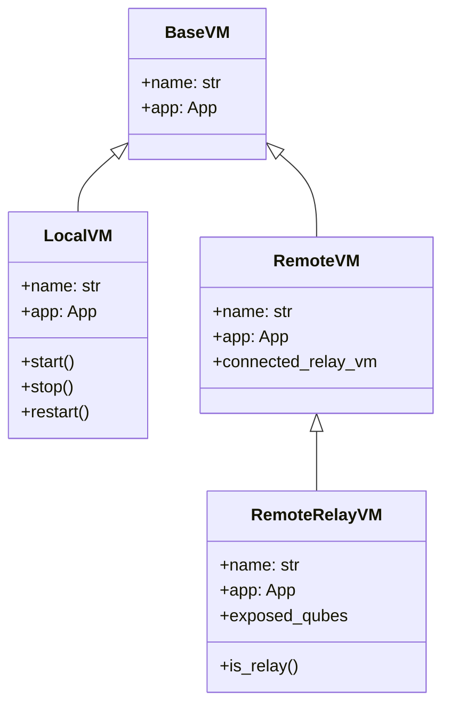
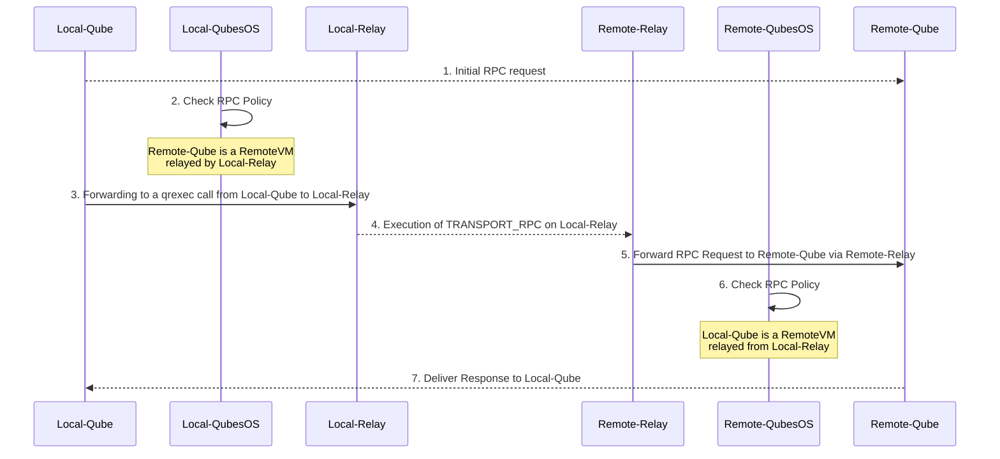
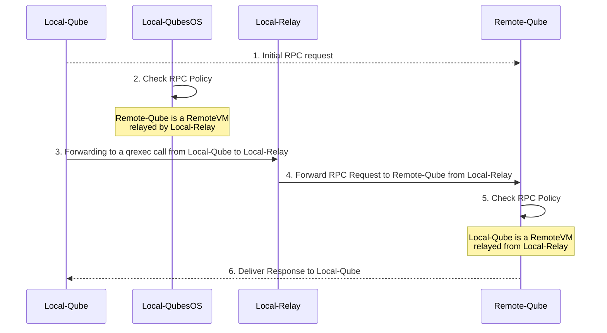

### General case: communications between qubes hosted in two different Qubes OS hosts 

Overview of summarized classes being used and defined in the following sections:



#### 1. Initial RPC request from Local-Qube to Remote-Qube on Local-QubesOS

This is the starting point where `Local-Qube` on Local-QubesOS initiates an RPC request to `Remote-Qube`, which is a RemoteVM.
`Local-Qube` does not have the knowledge of `Remote-Qube` being a `RemoteVM` on Remote-QubesOS.
The request is straightforward and includes the service to be invoked, the argument, and the source and target qube as usual:

```json
{
  "service": "my_service",
  "arg": "my_arg",
  "source": "Local-Qube",
  "target": "Remote-Qube"
}
```

#### 2. RPC Policy process on Local-QubesOS

Local-QubesOS processes the RPC request using its policy engine.
It identifies that `Remote-Qube` is a RemoteVM, meaning it is not on Local-QubesOS but rather accessible through `Local-Relay` being a LocalVM on Local-QubesOS and `Remote-Relay` being `RemoteRelayVM` on Remote-QubesOS.
The communication between `Local-Relay` and `Remote-Relay` is facilitated using a `transport_method` RPC, lets called it TRANSPORT_RPC, which is an available RPC service on `Local-Relay`.

#### 3. Making a Qrexec call from Local-Qube to Local-Relay

To initiate the RPC request, a call is made from `Local-Qube` to `Local-Relay`.
This request includes all the necessary information to reach `Remote-Qube` via `Remote-Relay`.

```json
{
  "service": "TRANSPORT_RPC",
  "arg": "@remote:Remote-Relay:Remote-Qube+my_service+my_arg",
  "source": "Local-Qube",
  "target": "Local-Relay"
}
```

#### 4. Execution of TRANSPORT_RPC on Local-Relay

Once `Local-Relay` receives the RPC request, it invokes the TRANSPORT_RPC service, passing along the destination relay `Remote-Relay` and the original RPC request.

As an illustration, the internal call made by qrexec on `Local-Relay` is similar to make the following command:
```bash
$ /etc/qubes-rpc/TRANSPORT_RPC Remote-Relay my_service Remote-Qube my_arg
```

> Remark: This would be facilitated by a `forward_rpc` method of the LocalVM.

In this execution, `Local-Relay` acts as an intermediary, packaging the request and forwarding it to final relay.
It is important to note that at this level, forwarding the original request initiated with qrexec to final relay will be delegated to TRANSPORT_RPC service.
This service is able to manage connections with the final relay.
Local-QubesOS `dom0` will know information about final relay, but it is not managing itself connection to it.
It is up to configurations made inside local and remote relays themselves.

> Remark: In the case of SSH, it will be required preliminary setup to copy and share public keys between each jump relay.
> One could additionally leverage [`Proxies and Jump Hosts`](https://en.wikibooks.org/wiki/OpenSSH/Cookbook/Proxies_and_Jump_Hosts).

#### 5. Remote-Relay forwards the RPC request to Remote-Qube on Remote-QubesOS

TRANSPORT_RPC extracts the original service and argument and then forwards the request to `Remote-Qube` by doing a qrexec from `Remote-Relay`:

```json
{
  "service": "my_service",
  "arg": "my_arg",
  "source": "@remote:Local-Relay:Local-Qube",
  "target": "Remote-Qube"
}
```

#### 6. RPC policy process on Remote-QubesOS

On Remote-QubesOS, the RPC policy engine processes the request to ensure that it complies with the allowed policies:

- Remote-QubesOS verifies that `Local-Qube`, via `Remote-Relay` is authorized to execute `my_service` with arg `my_arg` on `Remote-Qube`.
- If the policy allows, the request is executed, and the response is sent back along the same relay chain, from `Remote-Relay` to `Local-Relay`, and finally to `Local-Qube`.

> Remark: The source info needs to be added to https://github.com/QubesOS/qubes-core-qrexec/blob/main/libqrexec/qrexec.h#L139-L143, probably as a new version of this message, for compatibility info.

It's crucial to verify that the correct relay is being used, but it has some limitation.
For example, if you have `AppVM1`, `AppVM2`, and `AppVM3` behind `Local-Relay`, the relay could misrepresent the origin of a request, claiming it came from `AppVM1` when it actually came from `AppVM2`.
However, `Local-Relay` cannot impersonate a request from `AppVM4`, since `AppVM4` is not configured to route through `Local-Relay`.
To mitigate such risks, end-to-end verification could be added to ensure the integrity of the request throughout the entire communication chain.
However, achieving full coverage would require unpacking and verifying the request at the target `dom0`, which introduces additional attack surface and complexity to the system.
Such approach is for now let for a further improvement of the mechanisms.

> Remark: Refusing unknown connections is the simplest and most straightforward approach.
> However, in the future, we could consider implementing a mapping system for such connections from specific relays.
> For example, if you have `AppVM1` and `AppVM2` connected via `Local-Relay`, any other unrecognized connection through `RelayVM1` could be mapped to a designated RemoteVM, like `Local-Relay-unknown`.
> This way, unexpected or misconfigured connections are still identifiable and managed, without outright rejection.

#### Summary



### Particular case: registering a RemoteVM not being on a QubesOS host

The general design allows to define and execute RemoteVM being not a "qube" on a Qubes OS host.
Indeed, making `qrexec-client-vm` installable on standard Linux or Windows machines would allow to execute RPC on them.
Such case is particular interesting if you need to interact with for example, KVM virtual machines, RaspberryPi, standard computer with huge resources, computer with different architectures than ones currently supported by Qubes OS, and so on.
It requires some adaptation on `qrexec` codebase to manage policies directly where `qrexec-client-vm` is running instead of `dom0`.

From the general case, assume that we have a LocalVM being `Local-Relay` and `Remote-Relay` is a running compatible `qrexec-client-vm` machine.
In that case, as a RelayVM is a RemoteVM, simply define `Remote-Relay` being a standard RemoteVM with `Remote-Qube` name, and you obtain the following:


